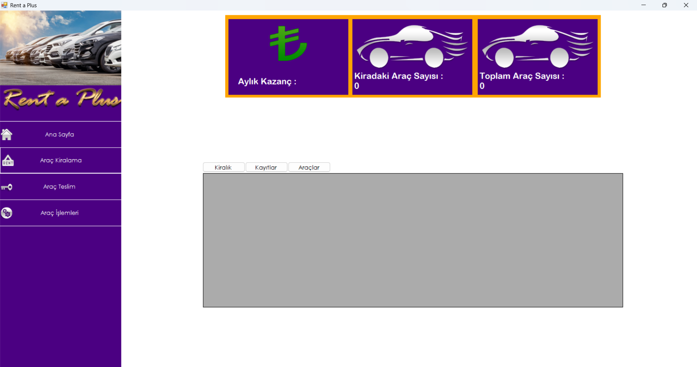
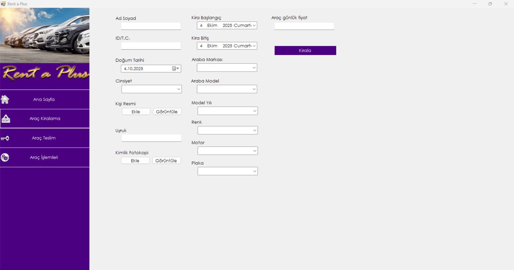
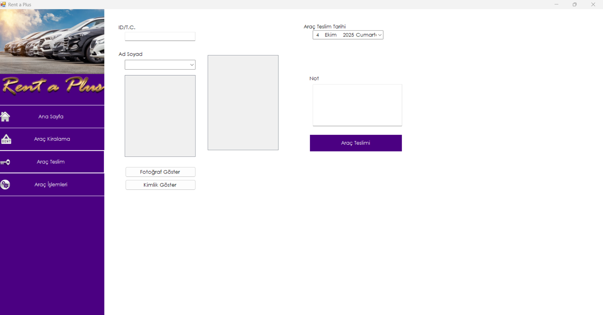
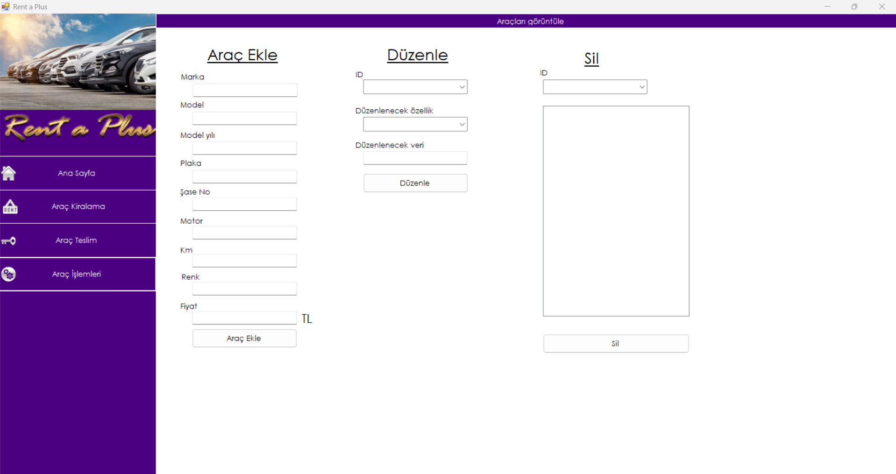

# 🚘 Rent_a_Plus - Araç Kiralama Otomasyonu

Rent_a_Plus, C# ve Windows Forms teknolojileri kullanılarak geliştirilmiş, araç kiralama süreçlerini dijital ortamda yönetmeyi sağlayan kapsamlı bir masaüstü otomasyon projesidir.

## 📋 Proje Hakkında

Bu proje, bir Rent A Car firmasının günlük operasyonlarını kolaylaştırmak amacıyla tasarlanmıştır. Kullanıcı dostu arayüzleri (Form yapısı) sayesinde araç takibi, müşteri yönetimi ve kiralama işlemleri hızlı ve hatasız bir şekilde gerçekleştirilebilir.

### 🚀 Özellikler

* **Kullanıcı Girişi ve Yetkilendirme:** Güvenli giriş ekranı (Form1).
* **Araç Yönetimi:** Araç ekleme, silme, güncelleme ve listeleme işlemleri.
* **Müşteri Kayıt Sistemi:** Müşteri bilgilerinin takibi.
* **Kiralama İşlemleri:** Araçların müsaitlik durumuna göre kiralanması ve teslim alınması.
* **Veritabanı Entegrasyonu:** Verilerin kalıcı olarak saklanması ve yönetilmesi.

## 🛠️ Teknolojiler ve Araçlar

Projede kullanılan temel teknoloji yığını:

* **Dil:** C#
* **Arayüz:** Windows Forms Application (WinForms)
* **Platform:** .NET Framework
* **Veritabanı:** Microsoft Acccess Database
* **IDE:** Visual Studio

## 📂 Proje Yapısı

Uygulama temel olarak aşağıdaki formlar üzerinden yönetilmektedir:

* **Form1.cs:** (Örn: Giriş Ekranı / Ana Menü)
* **Form2.cs:** (Örn: Araç Listeleme ve Kiralama Ekranı)
* **Form3.cs:** (Örn: Müşteri Yönetimi veya Sözleşme Ekranı)

